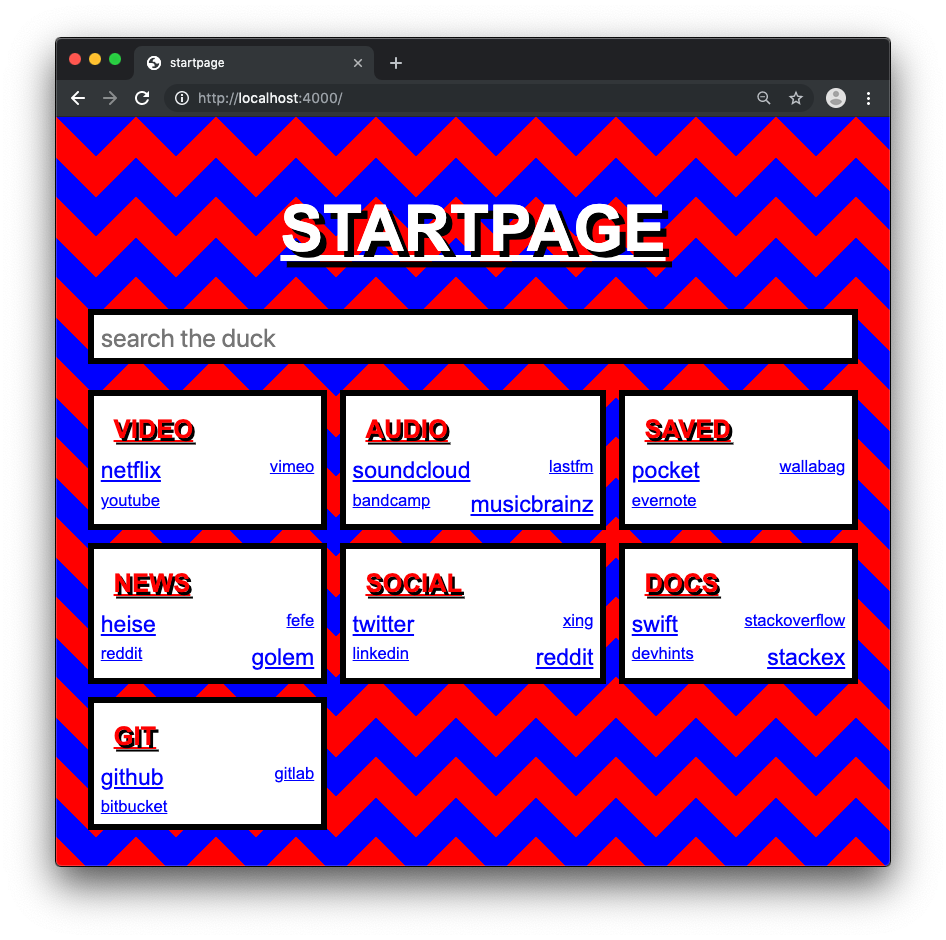

# [startpage](https://dotwee.github.io/startpage/)

_a very ugly, distracting* and irritating startpage for your web surfer**_


<sub>* bad enough to procrastinate as soon as possible</sub>
</br>
<sub>** your web surfer on all platforms, it's responsive!</sub>



> **anecdote**: made within a few hour to annoy some people. i'll probably never touch this code again.

> **recruters**: please don't look

## setup

1. install a full [ruby development environment](https://jekyllrb.com/docs/installation/)
2. install [jekyll](https://jekyllrb.com/) and [bundler](https://jekyllrb.com/docs/ruby-101/#bundler) [gems](https://jekyllrb.com/docs/ruby-101/#gems):

    ```bash
    $ gem install jekyll bundler
    ```

3. clone git repository and change into repo directory:

    ```bash
    $ git clone https://github.com/dotWee/startpage.git startpage && cd startpage
    ```

## usage

### run site locally using [jekyll](https://jekyllrb.com/)

1. install required dependencies:

    ```bash
    $ bundle install
    ```

2. build the site and make it available on a local server:

    ```bash
    $ bundle exec jekyll serve
    ```

3. now browse to [localhost:4000](http://localhost:4000)

### run site using [docker](https://www.docker.com/)

```bash
$ docker run --rm \
    -p 4000:4000 \
    --volume="$PWD:/srv/jekyll" \
    -it jekyll/jekyll:latest \
    jekyll serve --force_polling --livereload
```

alternatively using [docker-compose](https://docs.docker.com/compose):

> **note**: see [./docker-compose.yml](./docker-compose.yml) for reference

```yaml
version: '3.7'
services:
  startpage:
    image: jekyll/jekyll:latest
    command: jekyll serve --watch --force_polling
    volumes:
      - $PWD:/srv/jekyll
    ports:
      - 4000:4000
```

```bash
$ docker-compose up -d
```

### update [ruby gems](https://rubygems.org/) dependencies

```bash
$ bundle update
```

### cleanup binaries

```bash
$ bundle exec jekyll clean
```

## customize

set your own categories with links by changing the [categories.json](./_data/categories.json) inside the [__data_](./_data)-folder.

just make sure it follows this scheme:

```json
[
    {
        "name": "social",
        "links": [
            ["twitter", "https://www.twitter"],
            ["xing", "https://www.xing.com"],
            ["linkedin", "https://www.linkedin.com"]
        ]
    },
    {
        "name": "docs",
        "links": [
            ["swift", "http://swift.org"],
            ["stackoverflow", "https://stackoverflow.com"],
            ["devdocs", "https://devdocs.io"],
            ["stackexchange", "https://stackexchange.com"]
        ]
    }
]
```

## license

copyright (c) 2019 lukas 'dotwee' wolfsteiner <lukas@wolfsteiner.media>

licensed under the [_do what the fuck you want to_](/LICENSE) public license
